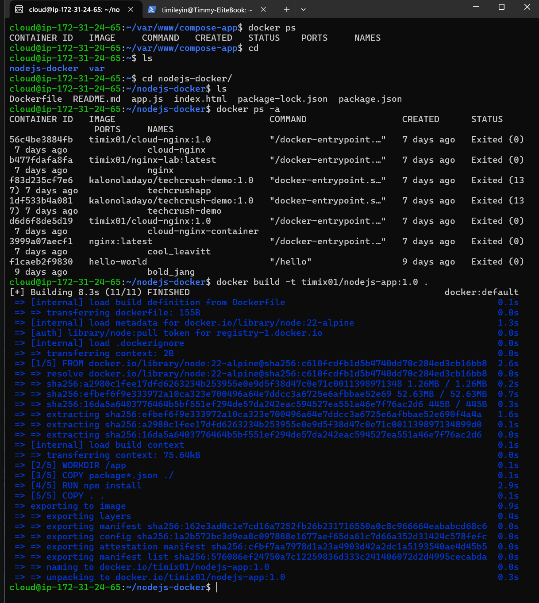
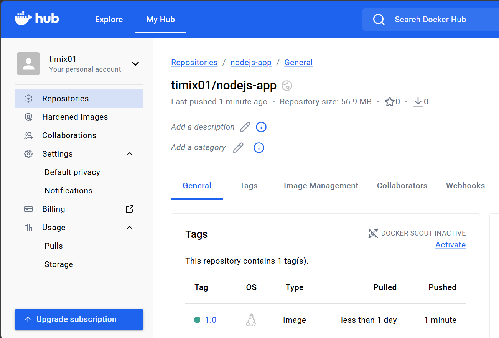
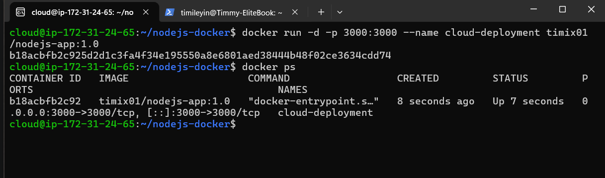
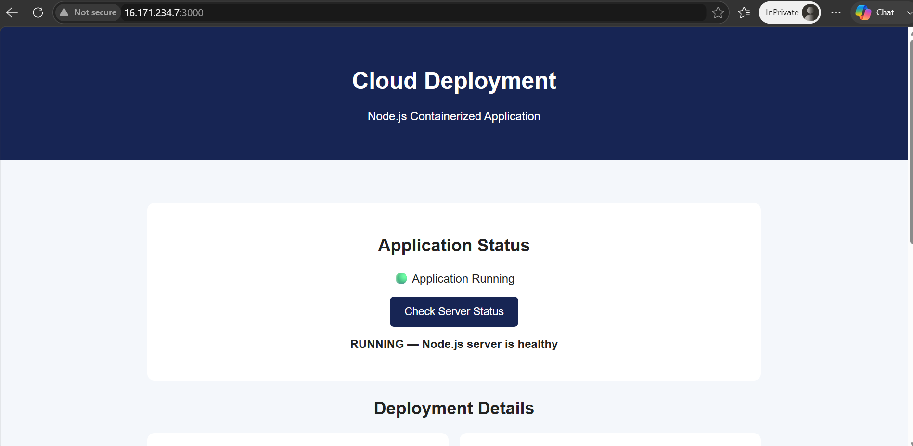

# Cloud Deployment

A simple Node.js application containerized with Docker and deployed on an Ubuntu Linux server hosted on AWS EC2.

This project demonstrates an end-to-end deployment workflow using GitHub, AWS EC2, Docker, and Docker Hub.

## Technologies Used

- Node.js
- Express.js
- Git & GitHub
- Ubuntu Linux
- AWS EC2
- Docker
- Docker Hub

## Deployment Workflow

The application followed this deployment process:

GitHub → AWS EC2 Ubuntu Server → Docker Image → Docker Hub → Docker Container → Live Application

## Docker Image Build

The Node.js application was containerized using a Dockerfile and built on the AWS EC2 Ubuntu server.

The image was tagged as:

`timix01/nodejs-app:1.0`

## Docker Hub Image

The Docker image was pushed from the AWS EC2 server to my Docker Hub repository with the `1.0` tag.

## Running Docker Container

The Docker image was pulled from Docker Hub onto the AWS EC2 Ubuntu instance and used to start a container.

Port `3000` on the EC2 host was mapped to port `3000` in the container.

## Live Application

The containerized Node.js application was successfully deployed on AWS EC2 and accessed through the EC2 public IP address on port `3000`.

The application also includes a server status check that confirms the Node.js server is running successfully.

